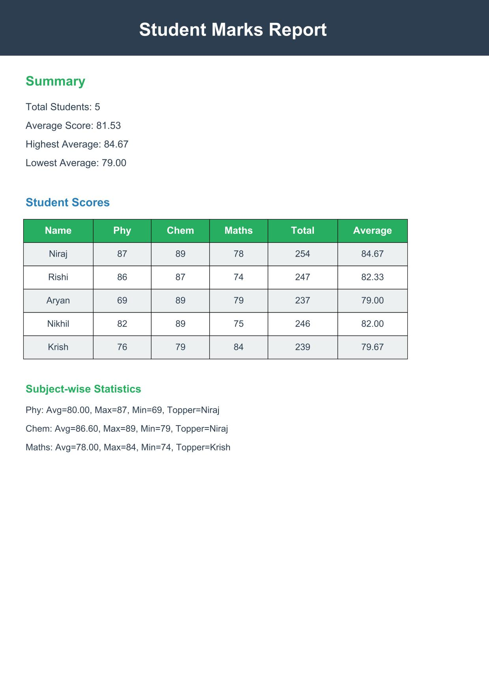

# AUTOMATED REPORT GENERATION

COMPANY:CODTECH IT SOLUTIONS

NAME:NIRAJ KUMAR YADAV

INTERN ID:CT04DF2492

DOMAIN:PYTHON PROGRAMMING

DURATION:FOUR WEEKS

MENTOR:NEELA SANTHOSH KUMAR

---

# 📊 Automated Student Report Generation

This Python project reads student marks from a CSV file, analyzes the data, and generates a well-formatted PDF report that includes summaries, tables, and subject-wise statistics.

---

## 🧠 Features

- 🔍 Reads marks for **Physics**, **Chemistry**, and **Maths** from a `data.csv` file
- 📈 Computes individual and class-wide statistics (average, max, min)
- 👑 Identifies top-performing students per subject
- 📝 Creates a **PDF report** with:
  - Summary statistics
  - A full table of all student scores
  - Subject-wise insights

---

## 🖼️ Screenshot



---


## 📁 Project Structure

```
.
├── automated_report_generation.py
├── data.csv
├── README.md
├── requirements.txt
├── OUTPUT_Screenshot/            
│   └── S1.jpg
├── MY_RESULT/            
    └── Report.pdf
```

---

## 📌 Dependencies

Install the required library using:

```bash
pip install fpdf
```

Or use the `requirements.txt`:
```bash
pip install -r requirements.txt
```

### `requirements.txt`
```
fpdf
```

---

## 📄 How to Use

1. **Prepare your CSV file**  
   Example format (`data.csv`):
   ```csv
   Name,Phy,Chem,Maths
   Niraj,78,88,92
   Santosh,85,79,84
   Aditya,90,91,89
   ```

2. **Run the script**:
   ```bash
   python automated_report_generation.py
   ```

3. **Output**:
   A PDF named `Report.pdf` will be generated in the same folder.

---

## 🧾 Output Example

- Summary of total students and average marks
- Table listing each student’s marks, total, and average
- Subject-wise statistics like top scorer, max/min marks

---

## 👨‍💻 Author

Developed by **NIRAJ KUMAR YADAV**